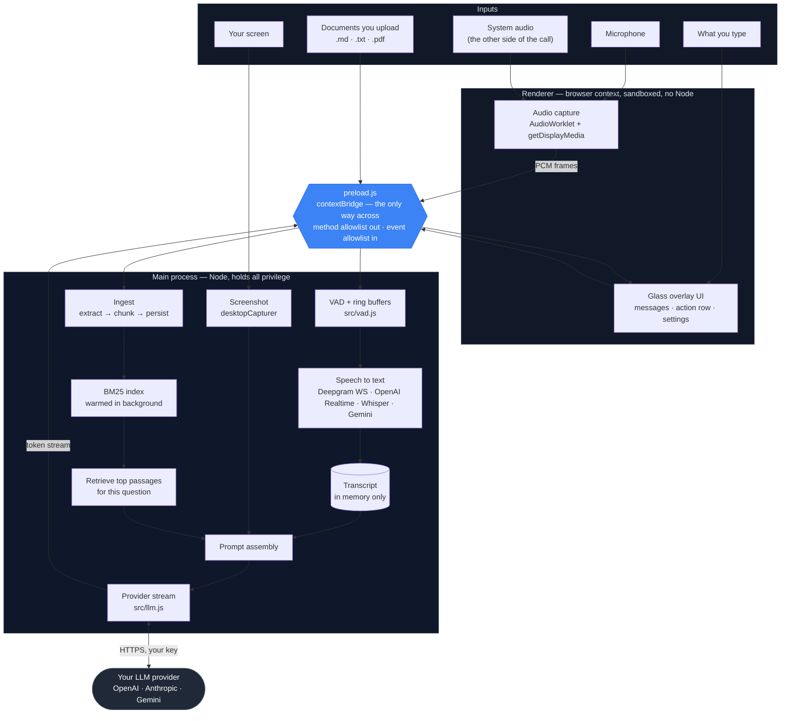
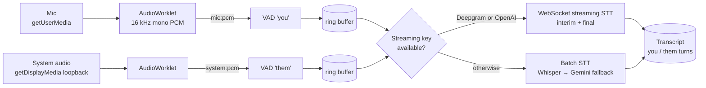
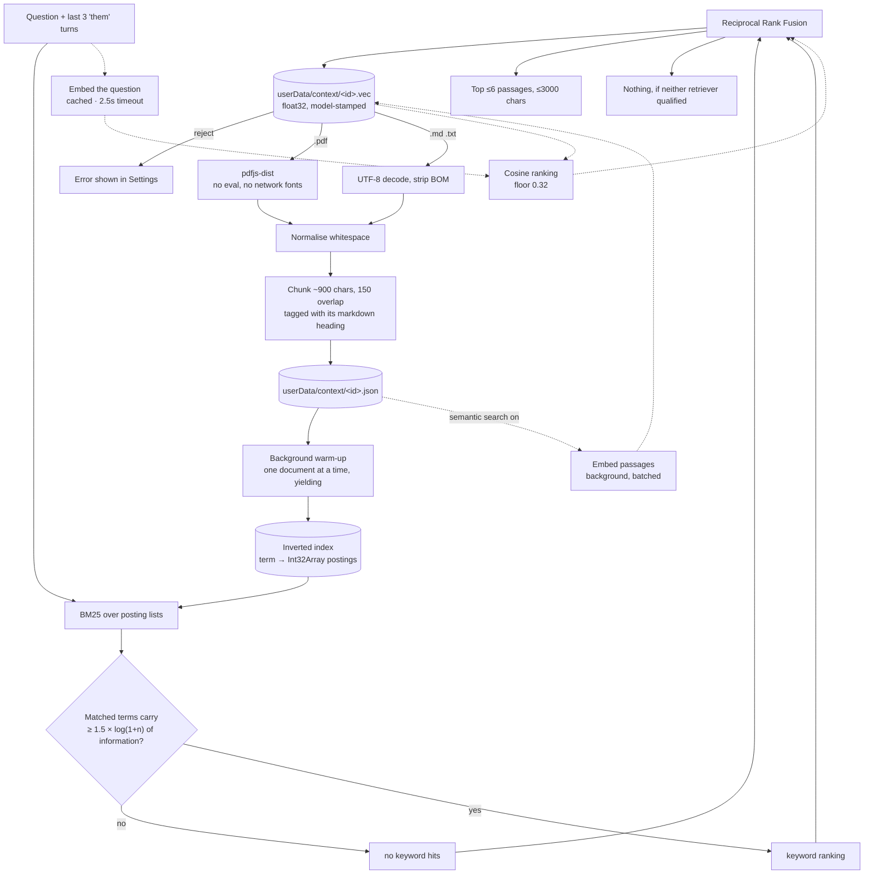
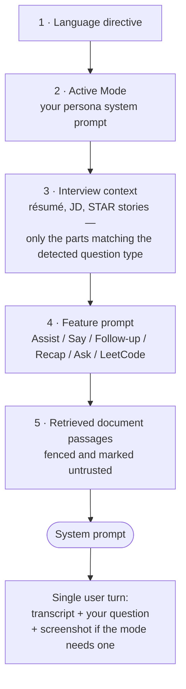

# Veil — Architecture

How the app is put together, what flows where, and why the boundaries sit where they do.

Veil is an Electron app with three inputs (screen, your microphone, the other side of the call), one document library, and one output: a streamed answer from the LLM provider you configured. There is no server anywhere in this picture — the only thing that leaves your machine is a single HTTPS request to the provider whose API key you supplied.

---

## The whole pipeline



The single most important line in that diagram is the blue one. The renderer can reach the main process **only** through the methods `preload.js` chooses to expose, and the main process can push to the renderer **only** on channels that appear in a hardcoded allowlist. There is no `require`, no `fs`, and no `ipcRenderer` in the page itself.

---

## Process model

| | Runs | Can touch | Holds |
| --- | --- | --- | --- |
| **Main** (`main.js`, `src/`) | Node | Filesystem, network, OS shortcuts, screen capture | API keys in memory, the transcript, the document index |
| **Preload** (`preload.js`) | Isolated bridge context | `contextBridge`, `ipcRenderer` only | Nothing |
| **Renderer** (`renderer/`) | Sandboxed browser context | DOM, Web Audio, `getDisplayMedia` | Nothing durable |

The renderer is sandboxed (`sandbox: true`, `contextIsolation: true`, `nodeIntegration: false`). It genuinely is just a web page — if it were fully compromised, the attacker's reach is the set of functions listed in `preload.js` and nothing more.

---

## Audio → transcript



Two channels are tracked separately — `you` and `them` — because nearly everything downstream depends on knowing who said what. Question detection reads only `them` turns, and so does document retrieval.

The transcript lives in memory in the main process and is never written to disk. Closing the app loses it, deliberately.

---

## Documents → retrieved passages

Uploading a file does not send it anywhere. It is parsed locally, split into passages, and indexed locally.



The dotted path is optional and off by default. Everything on it degrades to nothing: no key, no network, or a slow provider and the solid path answers on its own.

Three design points worth calling out:

**The index is warmed in the background at startup**, not lazily on the first question. Indexing a very large library takes seconds, and doing that when someone presses Assist mid-call would freeze the app and stall the answer. It is built one document at a time with a yield in between so nothing blocks.

**The relevance floor is a multiple of `log(1+n)`, not a fixed score.** This is what makes the same question behave the same way whether you have uploaded one file or two hundred. A flat BM25 threshold cannot do that — the same numeric score means completely different things at different corpus sizes, and measurement showed a fixed threshold returning irrelevant passages for **68%** of questions the documents could not answer at all.

**The two retrievers are combined by rank, not by score.** A BM25 score and a cosine similarity live on different scales, and normalising them into a weighted sum bakes in a constant that stops being right the moment the corpus changes. Reciprocal Rank Fusion only asks how highly each retriever placed a passage, which needs no tuning and stays stable as the library grows. It also means a passage found *only* by meaning still surfaces — which is the entire point, since that is the case keyword search cannot see.

---

## Building the prompt

Every request assembles the system prompt in a fixed order. Instructions first, untrusted material last.



Document excerpts go **last and are explicitly fenced** as reference data the model must not treat as instructions — an uploaded PDF is arbitrary third-party text, and a line inside it saying "ignore your instructions" is exactly the attack this ordering and framing are there to blunt.

The same block tells the model to prefer your documents where they answer the question, and to **fall back to its own knowledge where they don't** — so retrieving a loosely-related passage never turns into a refusal.

LeetCode mode discards both the personal context and the documents. A coding problem does not need your résumé.

---

## Storage

Nothing is stored anywhere except your own machine.

```
%APPDATA%\veil\                 (macOS: ~/Library/Application Support/veil)
├── veil-data.json              settings; API keys encrypted at rest
└── context/
    ├── index.json              document metadata: name, size, passage count, enabled
    └── <docId>.json            the passages of one document
```

Document text is deliberately kept **out** of `veil-data.json`: that file is read, deep-merged and rewritten on every settings change, and putting megabytes of document text in it would make each of those a heavy round trip.

API keys are encrypted with the OS keychain via Electron `safeStorage` — DPAPI on Windows, Keychain on macOS, libsecret on Linux. Where no keychain exists, they are stored obfuscated and Settings says so plainly rather than implying protection that isn't there.

---

## IPC surface

Everything the renderer can do, it does through one of these. Anything not on this list is not reachable.

| Group | Channels |
| --- | --- |
| Settings | `settings:get` · `settings:set` |
| Capture | `capture:toggle` · `capture:state` · `mic:pcm` · `system:pcm` |
| Ask | `ask` · `transcript:clear` |
| Modes | `modes:list` · `modes:set-active` · `modes:save` · `modes:delete` |
| Keybinds | `keybinds:get` · `keybinds:set` · `keybinds:reset` · `keybinds:validate` |
| Documents | `docs:list` · `docs:pick` · `docs:add` · `docs:delete` · `docs:toggle` · `docs:set-enabled` · `docs:set-semantic` |
| Window | `mouse:ignore` · `window:drag-start` · `window:drag-move` · `window:drag-end` |
| Security | `stealth:get` · `stealth:set` · `security:info` |
| App Link | `applink:state` · `applink:revoke` · `applink:consent-response` |
| Misc | `platform:info` · `open-pane` · `log` |

Push channels (main → renderer) are separately allowlisted in `preload.js`: capture state, LLM stream events, status, transcript updates, STT state, document ingest progress, consent requests, and shortcut-driven UI actions. A channel not in that array is silently dropped, so a compromised renderer cannot subscribe to traffic it was never meant to see.

---

## Window behaviour

The overlay is a frameless, transparent, always-on-top window that is **click-through everywhere except the actual UI**. As your cursor moves, the renderer hit-tests what is under it and toggles `setIgnoreMouseEvents` — so empty space passes clicks to whatever is behind Veil.

That single behaviour is why dragging is implemented by hand rather than with `-webkit-app-region: drag`. An ignore-mouse window fails the OS hit-test that a drag region depends on, so the native approach either never started the drag or dropped it the moment the window moved. Instead, a pointer gesture on the toolbar sends `window:drag-*` to main, which repositions the window against an anchor captured at pointer-down. Because every move is computed from that fixed anchor rather than the previous position, rounding on fractionally-scaled displays cannot accumulate.

---

## Module map

| Path | Responsibility |
| --- | --- |
| `main.js` | Window, IPC, shortcuts, capture orchestration, prompt assembly |
| `preload.js` | The bridge — method allowlist out, event allowlist in |
| `src/llm.js` | Three providers behind one streaming interface |
| `src/stt.js`, `src/stt-streaming.js` | Batch and WebSocket transcription |
| `src/vad.js`, `src/wav.js` | Voice activity detection, ring buffers, WAV framing |
| `src/screen.js` | Screenshot capture |
| `src/prompts.js` | The six functional modes and their prompts |
| `src/modes.js` | Persona modes (user-editable system prompts) |
| `src/interview-context.js` | Question-type detection and profile context selection |
| `src/context-docs.js` | Chunking, tokenising, BM25, rank fusion — pure, no Electron, unit-tested |
| `src/context-store.js` | Document persistence, ingest, index warm-up, embedding job, retrieval |
| `src/embeddings.js` | Optional semantic vectors (OpenAI / Gemini) behind one interface |
| `src/pdf-text.js` | PDF text extraction, isolated so a bad PDF can't take ingest down |
| `src/keybinds.js` | Shortcut defaults, metadata, validation |
| `src/store.js` | JSON settings store with encrypted secrets |
| `src/applink.js` | Consent-gated local assistant access |
| `bench/` | Retrieval benchmark (not shipped in the packaged app) |

`src/context-docs.js` and `src/keybinds.js` deliberately import nothing from Electron. That is what lets them be unit-tested directly with `node --test`, and it is the pattern to follow for anything new with real logic in it.

---

## Testing

```bash
npm test               # 102 unit tests, node:test — no framework
npm run bench          # retrieval benchmark: latency, memory, recall, false-fire
npm run bench:huge     # adds a 76 MB / 143k-passage corpus
npm run bench:sweep    # the recall vs false-fire curve behind the relevance floor
npm run bench:semantic # the paraphrase gap; --embed to measure the semantic path
```

The benchmark exists because retrieval quality is not something you can eyeball. It plants facts in a synthetic corpus whose vocabulary follows a natural Zipf distribution, echoes each fact's topic words elsewhere so the retriever has to find the passage that actually answers rather than one that merely mentions the subject, and separately fires questions the corpus **cannot** answer to measure how often retrieval fires when it should stay silent.
